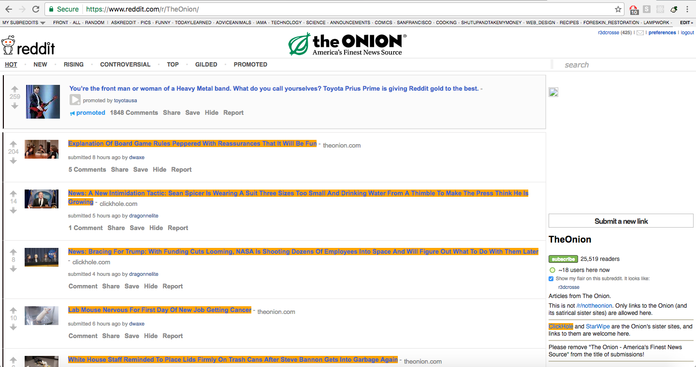

# Newsgate
Sniffing the news

## We created a chrome extension that gives people the power to know whether the information they're consuming is real or fake. Users can further customize their tastes with Newsgate and will be able to distinguish a favorable link from a 'blacklisted' one without ever even having to lift a finger, or in this case, clicking on a link.

## Project Vision
Create a convenient and insightful way for people to make decisions about the validity of news stories. We set out hoping to create an algorithm that would determine the quality of news stories and allow our users to seamlessly discern between fact or fiction. 

## Instructions for admins
### Running the project
1) npm install
2) bower install
3) cd client and then npm install 

### Do the following: 

### Load blacklist

Newsgate utilizes the blacklist currated by the creators of https://github.com/bs-detector.  In order to load the blacklist:

1) Ensure that Mongo is running 
2) Ensure that you've already run 'npm install' 
3) Run 'npm run blacklist'

### Update the blacklist

Newsgate includes a script to fetch the latest version of the blacklist from "https://raw.githubusercontent.com/bs-detector/bs-detector/dev/ext/data/data.json".  When the script runs it will:

1) Add all new blacklisted sites (found in the bs-detector file) to the database 
2) Update all existing blacklisted sites to ensure proper categorization 
3) Overwrite your local copy of blacklist.js with the updated database content 

####In order to update the blacklist:

1) Ensure that Mongo is running 
2) Ensure that you've already run 'npm install' 
3) Ensure that you've already run 'npm run blacklist' 
4) Run 'npm run blacklist:update'

#### Blowing away the database

This will drop the Mongo database.  

1) Ensure that Mongo is running 
2) Run 'npm run reset'

### Add the chrome extension
1) In chrome://extensions enable developer mode (checkbox in the upper right corner)
2) drag and drop newsgate/ext folder into the extensions window. 
3) the extension should show up in your chrome toolbar

## Team (github handle)
### Evan Chiang (MistrBrown) - Product Owner 
### James Gu (james-gu) - Scrum Master 
### Matt Walsh (wattmalsh) - Dev Team 
### David Wayman (r3dcrosse) - Dev Team 

## Legacy Creators
### David An, Emerson Hum, Forrest Murray, Aaron Trank 
